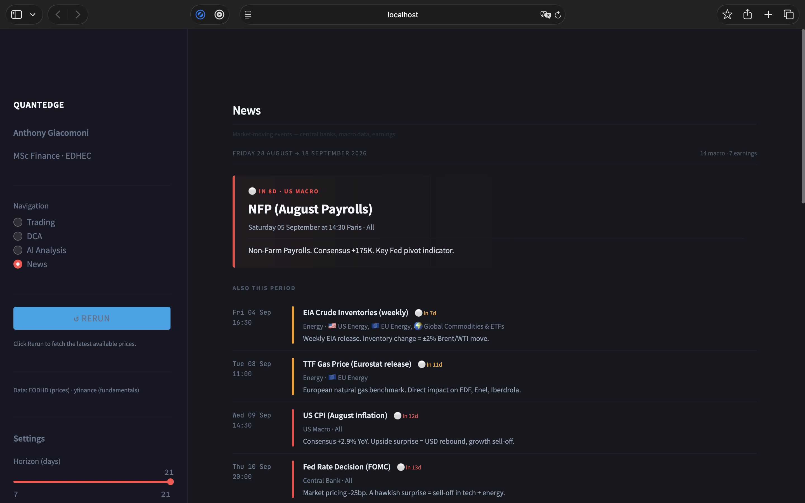

# QuantEdge — Trading & Market Intelligence Dashboard

QuantEdge is a personal finance/data-engineering project built to track a strategy-tagged
real-trade analytics dataset, analyse a long-term DCA portfolio, structure AI-assisted research
notes, and monitor source-labelled upcoming market catalysts.

It is a research dashboard, not an execution engine and not a production
trading system.

## Interface Preview



## Features

- **Trading** — bundled strategy-tagged personal trade analytics dataset, realised P&L, cumulative realised P&L,
  sector breakdown, and **on-demand unrealised P&L refresh using the latest
  available market quotes**. Each open-position quote carries its provider,
  timestamp/staleness state and quote currency.
- **Rule-based setup scoring (backend)** — the same history/fundamentals snapshot used by AI Deep Dive
  is passed through a transparent six-factor score: drawdown, exact five-session momentum, short interest,
  relative volume, support distance and a volatility-scaled price-move heuristic. No second provider fetch is
  performed for this score. Relative volume compares the latest bar with the previous 20 sessions.
- **DCA** — Excel portfolio ingestion, money-weighted annual performance via
  **XIRR**, allocation/product analytics, and deterministic 5% / 8% / 11%
  long-term scenario projections.
- **AI Analysis** — structured Claude-assisted trade notes using explicitly
  sourced market data. Price/history data may come from EODHD or yfinance;
  fundamentals come from yfinance. The model is instructed not to invent dated
  catalysts when no provider-supplied event data is supplied.
- **News & Catalysts** — fourth navigation page using source-labelled provider data with bounded fallbacks.
  EODHD calendar/news endpoints are used when the configured entitlement permits them; official
  BLS/Federal Reserve/ECB calendars supply **US/EU** macro dates when needed; other selected
  regions remain explicitly unavailable if EODHD is inaccessible. yfinance is a cached
  fallback for watchlist earnings/news. HTTP 403 entitlement failures and Yahoo HTTP 429 rate limits
  trigger process-local cooldowns instead of repeated rerun spam. QuantEdge does not ship a manually maintained future-event calendar. Optional Claude analysis is bounded to the events/headlines
  actually supplied by those sources.

## Market-data architecture

All application modules call `utils/market_data.py`; the portfolio no longer
imports a provider directly.

| Data | Primary source | Fallback / notes |
|---|---|---|
| Latest available prices | EODHD when configured | yfinance if EODHD returns no usable quote |
| Historical OHLCV | EODHD when configured | yfinance fallback |
| Fundamentals | yfinance | Provider failures remain `unavailable`, never `revenue=0` |
| FX conversion | explicit ticker/exchange currency mapping | EODHD/yfinance FX rates to EUR |
| Upcoming macro events | EODHD Economic Events when entitled | Official BLS / Federal Reserve / ECB calendars for US/EU only; other regions fail closed; no hard-coded replacement dates |
| Upcoming earnings | EODHD Earnings Calendar when entitled | Cached yfinance watchlist fallback; 429 circuit breaker |
| Recent news context | EODHD News when available | Cached yfinance fallback; context only, never presented as a future scheduled event |

Supported quote-currency mapping includes EUR, USD, GBP, HKD, TWD, AUD, CAD and CHF listings.
Unknown exchange suffixes fail closed instead of silently defaulting to USD.

## Quote semantics

QuantEdge does **not** claim streaming or real-time P&L. The Trading page is
refreshed on demand. A quote can be delayed or fall back to the latest end-of-day
mark; the UI exposes staleness per open ticker.

## Stack

Python 3.11–3.12 · Streamlit · pandas · NumPy · Plotly · SQLite · EODHD API ·
yfinance · Anthropic Claude API · openpyxl

## Setup

```bash
git clone https://github.com/anthony-giacomoni/quantedge.git
cd quantedge
python3 -m venv .venv
source .venv/bin/activate
pip install -r requirements.txt
cp .env.example .env
streamlit run app.py
```

Add your own API keys to `.env`. The file is ignored by Git.

## Demo mode and local data

The real DCA workbook is private and ignored by Git. The repository ships an
anonymised `examples/simu_invest_demo.xlsx`. A validated local `data/simu_invest.xlsm`
or `data/simu_invest.xlsx` takes priority; only when neither exists does the DCA page open the clearly
labelled anonymised demo dataset. Uploads are parsed and validated before replacing local data.

The repository bundles the manually curated strategy-tagged sample in `utils/seed_trades.py`; closed broker P&L is stored as source data and is not independently reconstructed from every reference ticker/price pair.

## Tests

```bash
pip install -r requirements-dev.txt
pytest -q
```

The regression suite covers XIRR and product reconciliation, malformed DCA workbooks,
five-session return semantics, EODHD→yfinance fallback, quote/FX staleness, exchange/currency
fail-closed behaviour, ETF/equity eligibility, NaN/inf handling, listing-calendar selection,
Claude provenance/guardrails, provider 403/429 cooldown behaviour, official-calendar/yfinance cache
idempotence and the bundled trade seed.

## Project structure

```text
quantedge/
├── app.py
├── config.py
├── refresh_universe.py
├── modules/
│   ├── portfolio.py
│   ├── ai_analysis.py
│   ├── dca.py
│   ├── screener.py
│   ├── news.py
│   └── prompt_builder.py
├── utils/
│   ├── db.py
│   ├── market_data.py
│   ├── event_data.py
│   ├── eodhd.py
│   └── seed_trades.py
├── examples/
│   └── simu_invest_demo.xlsx
└── tests/
```

## Strategy-tagged trade dataset in the bundled seed

27 manually curated strategy-tagged samples from **26 May 2025** onward: 25 closed + 2 open. Descriptive statistics of this selected dataset are 24 wins + 1 loss on closed samples, €2,210.61 realised P&L, 96.0% dataset win rate, 24.08x dataset profit factor and a 13.0-day average holding period. These are dataset summaries, not complete-account performance claims.

Realised P&L values are stored from the broker/trade record. For historical rows, `ticker` is the reference/underlying symbol used for market analytics and recorded entry/exit marks are broker-recorded fields; they are not asserted to be exchange executions in that reference symbol. Some rows represent leveraged/wrapper exposure. Closed P&L is therefore not reconstructed from reference-ticker price moves. For the two current open cash-equity positions, the recorded entry price and invested
amount are broker base-currency (EUR) values. The latest market quote is converted to EUR first,
then compared with that recorded EUR cost basis. Unrealised P&L is gross of future exit costs.


`direction` in the seed means **directional exposure** (`LONG`/`SHORT`), not necessarily the broker order side of the exact listed security. For historical leveraged/derivative trades, `ticker` can be a reference/underlying used for market analytics while the recorded entry/exit fields are broker product marks. Therefore closed-trade P&L is taken from the broker record and is not reconstructed from reference-ticker price moves. The two currently open positions are cash-equity longs and are marked from current quotes using their EUR broker cost basis.

The seed is the dataset used by QuantEdge analytics; it is not presented as a
complete brokerage-account ledger. Operational/execution-only events outside
the strategy-tagged dataset are not part of these performance statistics.

## AI and privacy

Anthropic is called only after an explicit user action. Ticker analysis sends the constructed research prompt; DCA analysis can send the displayed holdings and portfolio amounts when a personal workbook is loaded. The UI discloses this before the DCA request. Successful responses save the user prompt, system prompt, SHA-256 hashes of both, model and max-token setting in the local SQLite database. This is request provenance, not deterministic model-output reproducibility; provider request IDs and every SDK/runtime detail are not persisted. The database is excluded from the public repository.

## Disclaimer

Personal project for portfolio/learning purposes. Not investment advice and not
a production trading system.


## Trading record methodology

The public trading table is a **manually curated strategy-tagged dataset**, not a complete brokerage-account statement or independently auditable track record. Tags define the analytical scope of this project; the public repository does not independently prove when historical tags were assigned. Closed-trade statistics fail closed if any included closed trade lacks broker P&L. Open-position marks are analytics estimates, not broker statements.


## Public release workflow

Do **not** zip the development directory. It intentionally contains local-only runtime state such as `.env`, `.venv` and `data/`. Build a distributable from the explicit allowlist instead:

```bash
python scripts/build_public_release.py /tmp/quantedge_public
python /tmp/quantedge_public/scripts/validate_public_repo.py /tmp/quantedge_public
```

The builder copies only explicitly permitted source/docs/tests/demo files, and the validator recursively rejects private/runtime artifacts and obvious secret/PII patterns. Provider history used by quantitative signals is also required to match the latest exchange session expected at refresh time; stale history fails closed.
